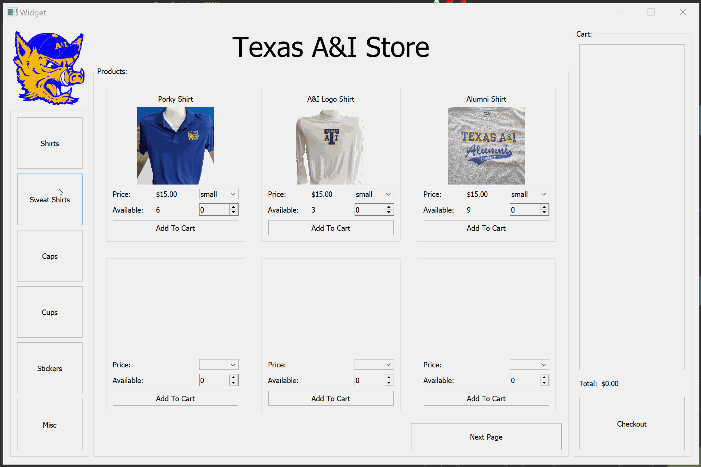
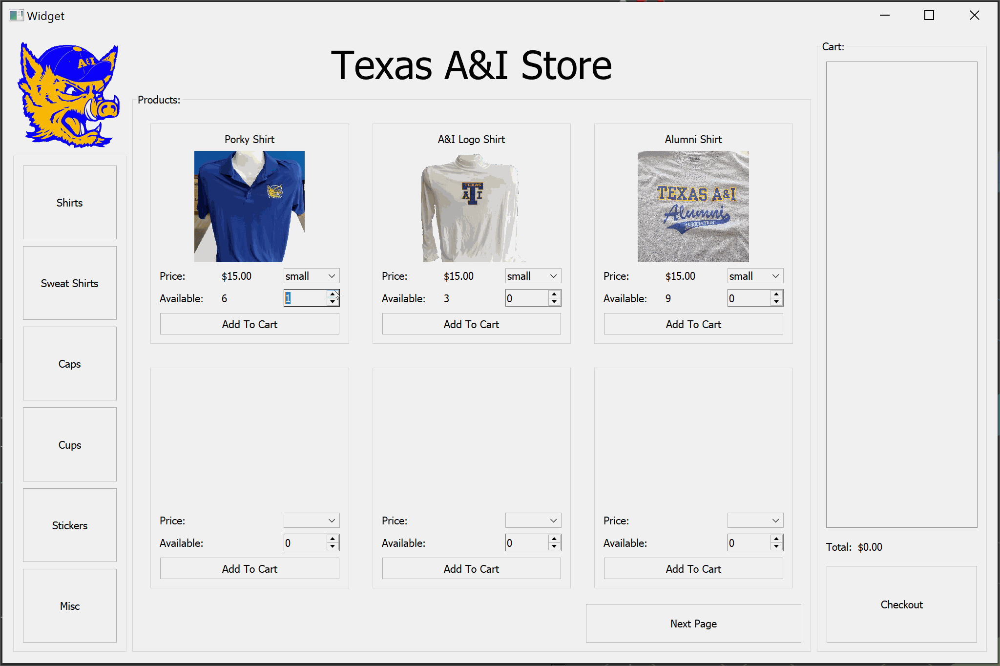

# Texas A&I Point of Sale System
A point of sale system for an A&I alumni merch store located on TAMUK campus. Uses the c++ based Qt tool to create GUI and Microsoft SQL Management Studio to host a local database to keep track of inventory.

Functionalities
--------------

1. The user can navigate through the different merchendise using the buttons in the left side panel.
2. You can add items into the cart and view your current total money due.

3. Use the increment/decrement buttons to select the amount of a specific murchandise the customer will want to purchase.
4. Some merchendise are offered in different sizes. Each size has it's own stock availability.

5. Press "Checkout" to pay.

Technologies used
--------------
1. C++
2. Microsoft SQL Server Management Studio
3. Qt